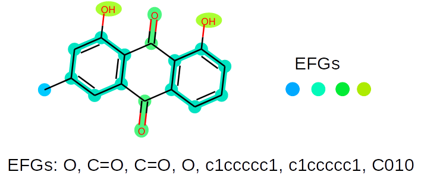

EFGs (Extended functional groups)
=======================================================

.. image:: https://img.shields.io/pypi/v/EFGs.svg
    :target: https://pypi.python.org/pypi/EFGs
    :alt: Latest PyPI version

Extended Functional Groups
----------------------------

Extended functional group is a generalized version of traditional functional group and it also contains chemical groups that formed by only carbon atoms. It is inspired by `Peter Ertl`_'s work: 

Ertl, P. An algorithm to identify functional groups in organic molecules. *J Cheminform* **9**, 36 (2017)

.. _Peter Ertl: https://jcheminf.biomedcentral.com/articles/10.1186/s13321-017-0225-z 

Built based on that, we also induced the idea that a moelcule should be fully covered by 'Functional Groups'.

The philosophy of EFG (Extended functional group) is to do fragmentation on molecules so that all fragments of the molecule are chemical valid. To do that, we:

1. **Identify aromatic structures.** If two atoms shared the same aromatic ring system, they would be merged.
2. **Identify special substructures**:
    * Mark all heteroatoms in a molecule
    * Mark ‘special’ carbon atoms (carbon atoms with double/triple bonds, acetal carbons and three-membered heterocycles.)
    * Merge all connected marked atoms to a single functional group
3. **Identify simple carbon chains**: sp3 carbons connected by two or more hydrogens
4. **Other single atoms** The number of single atoms can be significantly reduced by defining subclasses and merging some of them together. All atoms are classified by their aromaticity, degree and formal charge and recorded as element symbol followed by three number corresponding to above properties. For example, Hydrogen (H\ :sub:`2`) would be H010, methyl group would be C010.

In order to alleviate the imbalance distribution of different EFGs, we proposed an iterative way to selectively decompose large functional groups:

1. Set a cut-off value α (0<α<1)

2. Collect sparse functional groups whose rankings are behind top α in frequency distribution

3. Further decompose collected functional groups:

    * a. Neighboring small functional groups which would be merged before would not be merged anymore unless they have shared atom(s).
    * b. (If i. is not applicable) Cut all single bonds
4. Repeat previous steps until the number of functional groups does not change.

For most molecular datasets, this method is able to describe > 99% molecules with < 1% number of EFGs. 

Requirements
^^^^^^^^^^^^

rdkit >= 2019.03

Installation
------------
1. To install from source (with latest version):

.. code:: bash

   $ git clone https://github.com/HelloJocelynLu/EFGs.git
   $ cd EFGs/
   $ python setup.py install
   $ python setup.py test # optional

2. Install from pip:

.. code:: bash

   $ pip install EFGs

Usage
-----

See *Tutorial.ipynb* in Examples/ folder for detailed examples.

*mol2frag* is the core function to do the fragmentation.

Licence
-------
MIT Licence.

Authors
-------

`EFGs` was written by `Jocelyn Lu <jl8570@nyu.edu>`_.

Reference
----------

Jianing Lu, Song Xia, Jieyu Lu and Yingkai Zhang., Dataset Construction to Explore Chemical Space with 3D Geometry and Deep Learning. *J. Chem. Inf. Model.*, **61**. (2021) https://pubs.acs.org/doi/10.1021/acs.jcim.1c00007

.. code:: bash

    @article{lu2021dataset,
      title={Dataset Construction to Explore Chemical Space with 3D Geometry and Deep Learning},
      author={Lu, Jianing and Xia, Song and Lu, Jieyu and Zhang, Yingkai},
      journal={Journal of Chemical Information and Modeling},
      volume={61},
      number={3},
      pages={1095--1104},
      year={2021},
      publisher={ACS Publications}
    }

Other projects in Zhang's Lab:
https://www.nyu.edu/projects/yzhang/IMA/
